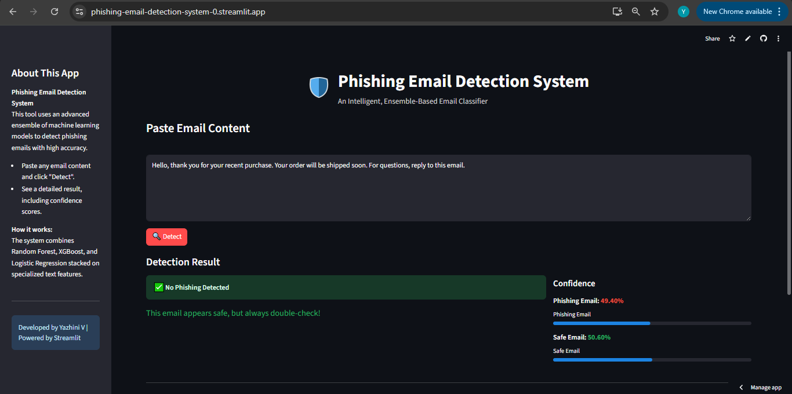

# Phishing Email Detection System

A professional, machine learning–powered web app to detect phishing emails using advanced ensemble models. Built with [Streamlit](https://streamlit.io), this project provides an intuitive interface for users to analyze email content and receive real-time, confidence-based predictions on whether an email is phishing or legitimate.

---

## Features

- **Ensemble Detection:** Utilizes Random Forest, XGBoost, and Logistic Regression models for robust classification.
- **User-Friendly Interface:** Clean, responsive UI built with Streamlit.
- **Instant Feedback:** Paste any email content to get immediate phishing detection with confidence scores.
- **Professional Design:** Custom branding and dark mode for a modern look.

---

## Live Demo

[Click here to try the app!](https://phishing-email-detection-system-0.streamlit.app/)

---

## Usage

1. **Clone the Repository**
    ```bash
    git clone https://github.com/YazhiniVenkatesan12/phishing-email-detection.git
    cd phishing-email-detection
    ```
2. **Install Dependencies**
    ```bash
    pip install -r requirements.txt
    ```
3. **Run the Application**
    ```bash
    streamlit run app.py
    ```

---

## App Screenshot



---

## License

This project is for educational purposes.  
© 2025 Yazhini V
